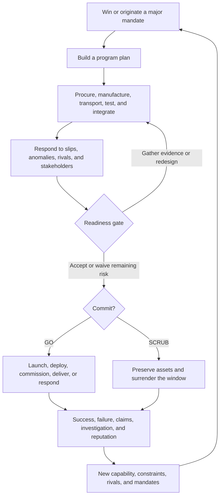
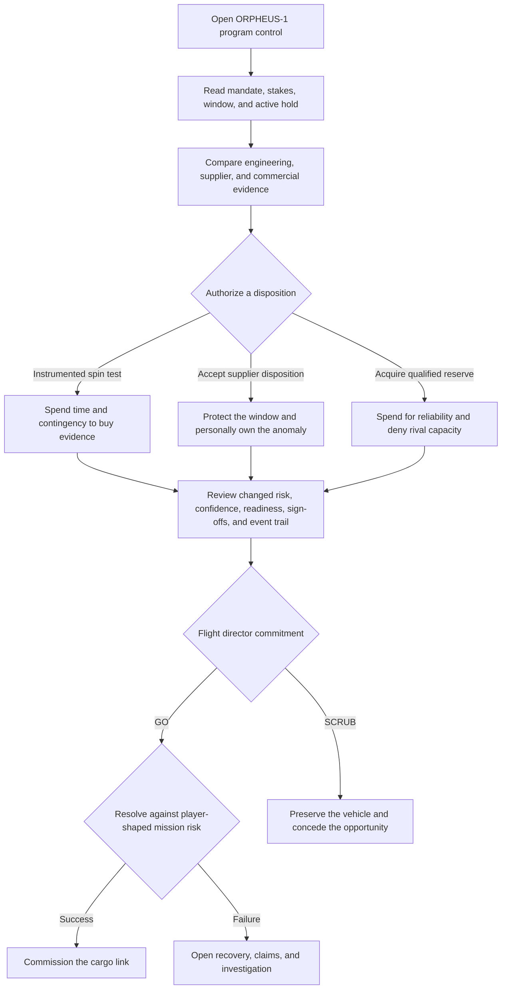

# Program campaign

## Purpose and current boundary

This document is the product reference for ASCENT’s player fantasy, campaign
loop, first-playable experience, and immediate roadmap.

The intended game is a campaign about directing high-stakes industrial programs
beyond Earth. The repository currently implements a much narrower proof of
concept: **ORPHEUS-1**, a client-only Svelte scenario that begins at a
flight-readiness gate and ends with a GO, SCRUB, or expired launch window.

The current scenario has no backend, saved campaign, accounts, autonomous
competitors, or multiplayer state. Its job is to prove that the central decision
feels legible, consequential, and worth building outward from.

## The player fantasy

> You run the industrial program that makes an impossible mission real.

The player is responsible for more than a launch-day checklist. A program has
been shaped over months or years by supplier awards, engineering compromises,
test strategy, transport plans, schedule buffers, financing, stakeholder
promises, and competitive pressure. At the commitment gate, that history becomes
one accountable decision.

The emotional center of ASCENT is:

> We are minutes from commitment. The replacement hardware is on the ground,
> the window closes tonight, the customer will walk if we delay, and the anomaly
> is still unexplained. Do I scrub?

## Intended campaign loop

One campaign may include launching a lunar cargo network, commissioning an
orbital refinery, deploying a surface reactor, establishing a habitat, or
rescuing a failing project. The form changes; the loop of preparation,
uncertainty, commitment, and consequence remains.

## What the player must understand

At any consequential moment, the interface should answer five questions:

1. **What are we trying to deliver?** The mandate, customer, strategic value,
   promised date, and definition of success are explicit.
2. **What threatens commitment?** The active hold, exposed dependency, closing
   window, and rival pressure are visible before secondary detail.
3. **What evidence do we have?** Engineering data, supplier provenance,
   independent review, commercial constraints, and unresolved uncertainty are
   distinguished from opinion.
4. **What does this decision change?** Cost, time, mission exposure, confidence,
   readiness, sign-offs, customer tolerance, and competitor position are
   previewed together.
5. **Who owns the consequence?** The disposition, objections, waivers, final
   poll, and director commitment remain part of the record.

## Decision causality

A failed component must not feel like an arbitrary punishment. The player should
be able to trace it back through the campaign:

- a cheaper supplier was selected despite a thin quality record;
- qualification was accelerated to protect the build schedule;
- a test was waived to preserve a launch window;
- stressed hardware was reused because a rival locked replacement capacity;
- an engineer’s warning remained open while the program exceeded its budget;
- too many dependent projects made one delay cascade into several.

Uncertainty still matters, but the player shapes its range. Tests buy
information. Redesigns sacrifice schedule for reliability. Capacity acquisitions
spend contingency to gain control. Waivers preserve opportunity while assigning
accountability. The final outcome may be uncertain; the risk presented at the
gate must have a comprehensible history.

## Campaign systems

| System                        | Campaign meaning                                                                              |
| ----------------------------- | --------------------------------------------------------------------------------------------- |
| Mandates                      | Customer, government, or rescue commitments that define success and strategic stakes          |
| Procurement                   | Supplier capacity, contract bids, insurance, scarce materials, and qualified reserves         |
| Manufacturing and integration | Flight-critical hardware, work packages, configuration, inspections, and rework               |
| Logistics                     | Movement of components, crews, propellant, test articles, and mission hardware                |
| Ground and mission systems    | Test stands, ground stations, launch pads, habitats, ranges, and operational devices          |
| Coordination                  | Program-team communication, stakeholder negotiation, escalation, and decision polling         |
| Alerts                        | Inspection failures, supplier slips, weather, telemetry anomalies, and political intervention |
| Accountability                | Configuration control, sign-offs, waivers, investigations, claims, and corrective actions     |
| Competition                   | Rival bids, capacity locks, first-mover windows, rescue offers, and public confidence         |

These systems should converge on mission decisions. They are not separate
activities whose only purpose is to increase a score.

## Current first playable: ORPHEUS-1

### Mission brief

Arcadia is preparing to deploy **Pioneer Tug** to lunar orbit and commission the
first autonomous cargo link before Vantage Orbital captures the customer’s
expansion mandate.

- **Customer:** Coalition Logistics Authority
- **Award:** 6.80B CR
- **On-time bonus:** 640M CR
- **Current phase:** Gate 4 readiness
- **Primary window at start:** T−08:42
- **Active hold:** QA-1044, an unexplained radial signature in the stage-2 fuel
  turbopump bearing

The event trail connects the anomaly to Kestrel Precision’s changed finishing
process and Arcadia’s earlier decision to accept a 14% underbid with accelerated
qualification.

### Playable flow

The launch-window countdown remains live throughout the scenario. If it reaches
zero before commitment, the range releases the corridor and ORPHEUS-1 stands
down.

### Disposition choices

| Response                         | Immediate tradeoff                                            | Result after authorization                                                                                |
| -------------------------------- | ------------------------------------------------------------- | --------------------------------------------------------------------------------------------------------- |
| Run an instrumented spin test    | Spend 42M CR and 3h 30m to reproduce the load profile         | Mission risk falls from 34% to 21%; confidence rises from 68% to 83%; technical and assurance holds clear |
| Accept the supplier disposition  | Preserve the full window and add no immediate cost            | Mission risk rises to 56%; confidence falls to 51%; objections remain as visible waivers                  |
| Seize the last qualified reserve | Spend 118M CR and 6h 15m on an expedited acquisition and swap | Mission risk falls to 11%; confidence rises to 90%; Vantage may slip 19 hours without the reserve         |

Authorization is one-way. The selected response updates the integrated readiness
matrix, named sign-offs, critical dependency chain, program spend, remaining
contingency, competitive pressure, and event trail before the commitment
controls unlock.

### Commitment

After disposition, the flight director has two valid choices:

- **GO** accepts the displayed mission risk and commits the program. The current
  proof of concept resolves success or failure by comparing a local uncertainty
  draw with the risk shaped by the player’s response.
- **SCRUB** preserves the flight hardware, releases the range, loses the current
  on-time opportunity, and protects the organization from knowingly committing
  an unacceptable vehicle.

Success commissions Pioneer Tug and improves reputation. Failure opens
recovery, claims, and investigation, with the chosen disposition shaping the
aftermath. A scrub is a strategic outcome, not a malformed version of success.

## State and feedback rules

- **Evidence precedes action.** Engineering, supplier, and commercial views must
  be available before a disposition is authorized.
- **Consequences are previewed.** The player sees material cost, schedule, risk,
  confidence, and competitive effects while comparing choices.
- **Authorization locks.** A recorded disposition cannot be silently replaced by
  a more favorable choice.
- **Readiness is evidence, not decoration.** System scores, notes, holds, and
  sign-offs change because of the selected response.
- **Waivers remain visible.** Accepting risk does not convert an objection into a
  clean bill of health.
- **Time changes the state.** The closing corridor can force a stand-down even
  when the player takes no action.
- **GO is uncertain but not arbitrary.** The outcome draw is evaluated against
  risk the player could inspect and influence.
- **SCRUB is meaningful.** Protecting the asset has real cost and strategic
  consequence, but it remains a responsible decision.
- **Replay is explicit.** Replaying creates a new local scenario; it does not
  imply that a campaign was saved.

## What the proof of concept establishes

ORPHEUS-1 tests whether:

- a dense mission-control workspace can establish priority without feeling like
  a collection of unrelated dashboards;
- one decision can connect engineering evidence, supplier history, money, time,
  readiness, accountability, and rivalry;
- the player can understand why mission risk changed;
- GO and SCRUB both feel consequential;
- a result naturally points toward reputation, claims, investigation, and the
  next mandate.

The proof of concept does **not** yet establish:

- playable mandate, planning, build, or integration phases;
- a multi-turn campaign or saved consequences;
- procurement, manufacturing, testing, or logistics simulations;
- autonomous rivals or negotiated stakeholder relationships;
- accounts, authentication, multiplayer coordination, or a shared authority;
- a backend, database, remote API, or durable event history.

## Next product slices

### 1. Make the buildup playable

Add decisions in the mandate, planning, build, and integration phases. Supplier
selection, schedule buffers, test plans, transport dependencies, substitutions,
and parallel programs should create the state eventually seen at readiness.

### 2. Build the causal dependency graph

Represent serialized hardware, work packages, suppliers, qualification evidence,
configuration changes, and approvals so an anomaly can be traced to player and
stakeholder decisions. Delays and defects should propagate through named
dependencies instead of appearing as isolated events.

### 3. Add scarce capacity and rivals

Let programs compete for launch windows, qualified reserves, specialist teams,
insurance, and customer confidence. Rivals should be able to outbid, lock
capacity, acquire distressed suppliers, expose unsafe shortcuts, or offer a
rescue when another program slips.

### 4. Persist the aftermath inside a campaign

Carry capability, reputation, debt, claims, investigations, supplier
relationships, and customer trust into the next mandate. Success should create
new strategic options; failure and scrub decisions should reshape rather than
simply end the game.

### 5. Introduce platform infrastructure only when required

Keep the immediate discovery work in the client-only proof of concept. Saved
campaigns, identity, multiplayer coordination, and an authoritative service are
later platform decisions, not implied current capabilities.

## Acceptance criteria for the next campaign slice

- At least one readiness problem is causally derived from earlier supplier,
  schedule, hardware, or test decisions.
- The player can inspect the dependency and evidence trail without reading
  implementation terminology.
- Every consequential choice previews its material cost, schedule, risk,
  confidence, relationship, and competitive effects.
- A readiness disposition updates the affected systems, named sign-offs,
  preserved objections, and program record.
- The final commitment cannot occur until required holds are resolved or
  explicitly waived.
- Success, failure, and scrub produce different persistent constraints and
  opportunities for the next mandate.
- A player can explain both why the program reached the gate and why the final
  outcome was plausible.
